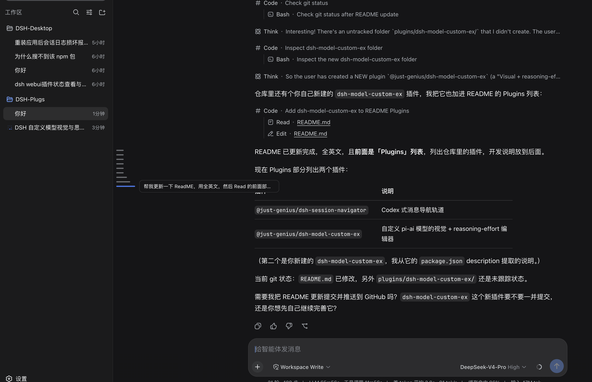

# DSH-Plugs

A monorepo of plugins for the [DeepSeek Harness](https://github.com/deepseek-ai/deepseek-harness) (DSH) — **one folder = one plugin**.

## Plugins

### [@just-genius/dsh-session-navigator](plugins/session-navigator)

A Codex-style message navigator rail: a vertical tick rail on the conversation transcript with one tick per user message, active highlight, stepped hover, and smooth jump.



### [@just-genius/dsh-model-custom-ex](plugins/dsh-model-custom-ex)

A visual + reasoning-effort editor for custom pi-ai provider models.

## Repository layout

```
DSH-Plugs/
├── package.json          # root workspace (shared build/type toolchain)
├── pnpm-workspace.yaml   # packages: ['plugins/*']
├── tsconfig.base.json    # shared TS config
└── plugins/
    └── session-navigator/   # one plugin per folder
```

## What a plugin is

A plugin is a Cordis plugin npm package split in two halves:

| Half | Source | Output | Role |
| --- | --- | --- | --- |
| node | `src/index.ts` | `lib/index.js` | Host entry (usually an empty `apply` for pure UI plugins) |
| browser | `src/client/index.tsx` | `lib/client.js` | Browser entry, registered via `window.__ModuleLoader__.load({ id, factory })` and mounting React panels with `ctx.slots.register` in `apply` |

Two key declarations in `package.json`:

- `dsh.client` — declares the browser-side injection (`inject` lists the client package names it depends on; `platform: web`).
- `dsh.bundle.patch` — points at `cordis.patch.yml`, so installing the package automatically inserts its loader row into the profile.

## Commands

```bash
pnpm install      # install dependencies
pnpm build        # build all plugins (src → lib)
pnpm watch        # watch and rebuild
pnpm typecheck    # type-check
pnpm clean        # remove all lib/
```

## Adding a plugin

1. Copy a `plugins/*` folder and rename it to your plugin name.
2. Set `package.json`'s `name` (keep the `@just-genius/dsh-*` prefix).
3. Edit `src/index.ts` (node half) and `src/client/index.tsx` (browser half).
4. `pnpm build`.

## Installing a plugin

```bash
# Link a local folder into the profile (relative paths anchor to the current directory)
dsh plugin --profile web add ./plugins/session-navigator
```

Because the package declares `dsh.bundle.patch`, it joins the profile's bundle layer automatically on install; **refresh the web page** to see it.

Uninstall:

```bash
dsh plugin --profile web remove @just-genius/dsh-session-navigator
```
