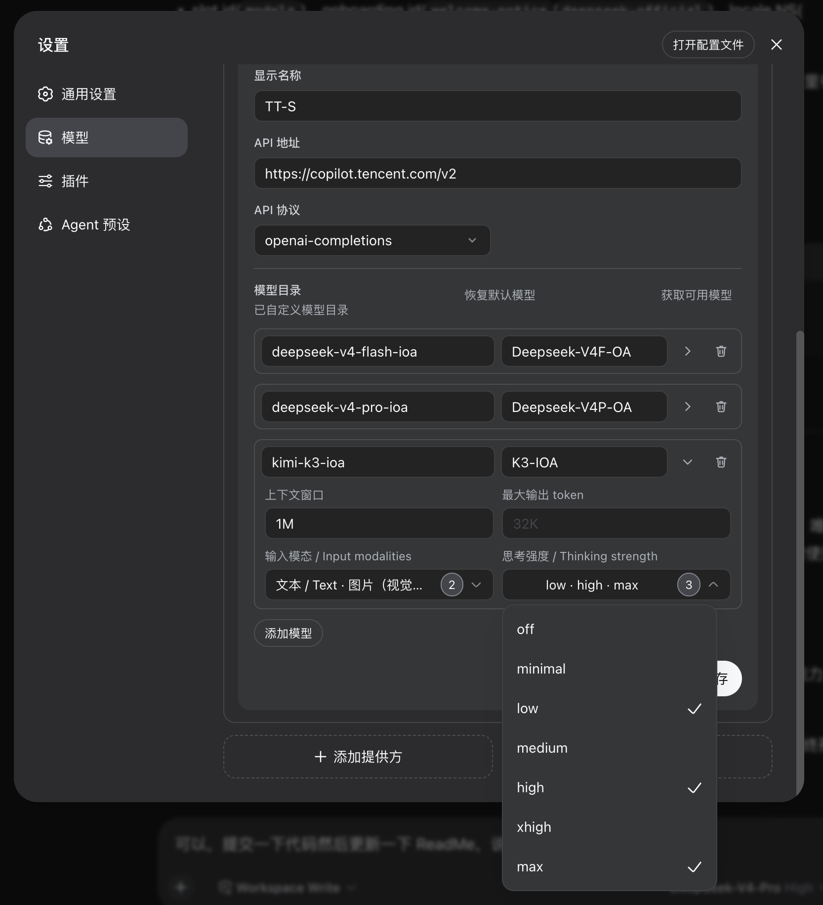

# @just-genius/dsh-model-custom-ex

在 DSH 官方「模型」设置页里，为自定义 provider 的每个模型增加两个官方页面刻意省略的**下拉多选**：

- **输入模态（Vision）** — 勾选「图片」即可让该模型声明 `input: [text, image]`，从而被判定为支持图片识别；
- **思考强度（Reasoning effort）** — 勾选 off / minimal / low / medium / high / xhigh / max 中任意等级，写入 `reasoningEfforts`，composer 的模型选择器随后会展示这些等级。

页面其余部分（provider 行、API key、抓取模型、删除确认、onboarding）与官方**逐像素一致**——本插件是官方 `@deepseek-ai/dsh-client-ui-settings-models` 的 fork，只改动了一处 `ModelListEditor.tsx`。



## 为什么需要它

官方 Models 页把 `input`（视觉）和 `reasoningEfforts`（思考强度）都留给了 `settings.yaml`：它们是**每个模型**的能力，官方 UI 的模型行编辑器里只渲染 id / 名称 / 上下文窗口 / 最大输出，没有这两个字段的控件。这意味着自定义模型默认被判定为「不支持图片」，思考强度也只能手写 YAML。

本插件 fork 官方源码，在模型行的「容量」折叠区里补上这两个下拉多选，写回同一个 `llm-pi-ai` 命名空间，因此与官方页面、composer 选择器、`settings.yaml` 100% 兼容。

## 安装

分两步：

1. 把插件加入 profile 的 bundle（等价于 `dsh plugin --profile web add ./plugins/dsh-model-custom-ex`）：
   - `~/.dsh/profiles/web/package.json` 的 `dsh.profile.bundles` 加入 `"@just-genius/dsh-model-custom-ex"`；
   - `dependencies` 加入 `"@just-genius/dsh-model-custom-ex": "link:/path/to/DSH-Plugs/plugins/dsh-model-custom-ex"`。

2. 在 `~/.dsh/profiles/web/cordis.patch.yml` 里 **disable 官方插件**，避免出现两个「模型」tab：

   ```yaml
   - id: ui-settings-models
     disabled: true
   ```

   本插件会完整接管官方插件的 locale 字典、Models section、以及两个 onboarding 步骤（`welcome-notice` / `deepseek-official`），所以 disable 后不会有功能缺失。

3. 重启 DSH web（改动了 bundle 栈 + cordis patch，刷新页面不够，必须重启）。

## 用 LLM 安装

也可以直接把下面这段提示词发给 DSH 的 agent，让它自动完成以上全部步骤（路径不同请自行替换）：

```text
帮我安装本地插件 @just-genius/dsh-model-custom-ex 到 DSH 的 web profile。

插件源码在 /Users/morisi/Space/DSH-Plugs/plugins/dsh-model-custom-ex。它 fork 了官方
@deepseek-ai/dsh-client-ui-settings-models，在官方 Models 设置页为自定义模型增加
「视觉」和「思考强度」两个下拉多选，因此安装时必须同时 disable 官方插件，
否则会出现两个「模型」tab。

步骤：
1. 构建插件：
   cd /Users/morisi/Space/DSH-Plugs/plugins/dsh-model-custom-ex && pnpm install && pnpm run build
2. 编辑 ~/.dsh/profiles/web/package.json：
   - dsh.profile.bundles 数组加入 "@just-genius/dsh-model-custom-ex"；
   - dependencies 加入 "@just-genius/dsh-model-custom-ex":
     "link:/Users/morisi/Space/DSH-Plugs/plugins/dsh-model-custom-ex"。
3. 编辑 ~/.dsh/profiles/web/cordis.patch.yml，加入：
   - id: ui-settings-models
     disabled: true
   （必须：让本插件成为 Models 页唯一 owner，避免重复 tab。）
4. 在 ~/.dsh/profiles/web 目录执行 pnpm install。
5. 重启 DSH web（改了 bundle 栈 + cordis patch，必须重启，刷新不够）。

验证：设置 → 模型 只有一个「模型」tab；编辑自定义 provider（如 tt / shuai-api）→
自定义设置 → 模型行「容量」折叠区出现「输入模态」「思考强度」两个下拉多选。

注意：写 ~/.dsh/profiles/web 需要 danger-full-access 权限，遇 sandbox 拒绝时
用 sandbox_permissions 重试一次。卸载时务必同时撤掉 cordis.patch.yml 里的
ui-settings-models disable，否则官方 Models 页会消失。
```

## 使用

1. 打开 **设置 → 模型**（只有一个「模型」tab）；
2. 点某个自定义 provider 的「编辑」，展开「自定义设置」；
3. 每个模型行点右侧的「容量」折叠箭头；
4. 在「上下文窗口 / 最大输出 token」下方会出现两个下拉多选：
   - **输入模态** — 「文本」固定置灰不可取消，勾选「图片（视觉）」开启视觉；
   - **思考强度** — 勾选需要暴露给 composer 的等级；全部取消会写 `reasoningEfforts: false`（声明为非推理模型）。

改完点「保存」，配置即时写入 `settings.yaml` 的 `llm-pi-ai` 段，下一个请求即生效，无需重启。

## 目录结构

- `src/index.ts` — 空的 host 半（bundle loader 入口）。
- `src/client/index.ts` — 注册 locale 字典 + Models section + onboarding（替代官方）。
- `src/client/*` — 官方 `ui-settings-models` 的 fork 源码；**唯一改动**是 `ModelListEditor.tsx` 加了两个多选器。
- `src/client/MultiSelectMenu.tsx` — 基于官方 `Menu`/`Pill` 原语的下拉多选组件。
- `tsdown.client.config.ts` — 用 `@just-genius/dsh-plugin-ui/css-modules` 的 `dshCssModules` 内联 `.module.css`，与官方 client bundle 一致。

## 构建

```bash
pnpm install
pnpm run build
pnpm run typecheck
```

浏览器半（`lib/client.js`）以 `window.__ModuleLoader__` 形式打包。

## 从上游同步

fork 的源码来自 deepseek-harness 仓库的 `packages/client/ui-settings-models/src/client`。官方升级后重新同步：

1. 重新 copy 该目录到 `src/client/`；
2. 重新在 `ModelListEditor.tsx` 里打上两处多选器改动（搜索 `输入模态` 定位）；
3. 保留 `MultiSelectMenu.tsx` 与 `index.ts` 的改动。

## 卸载

同时撤掉 `cordis.patch.yml` 里的 `ui-settings-models` disable，以及 bundle 里的插件条目，否则官方 Models 页会因被 disable 而消失。
